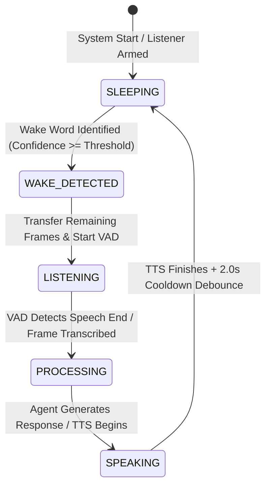

# ASTRA V2-05: True "Hey ASTRA" Wake-Word System Architecture

## 1. Executive Summary & Privacy Principles

In previous versions of ASTRA, hands-free activation was implemented by continuously capturing 1.2-second microphone audio slices and streaming them across the internet to Google Cloud Speech-to-Text (`recognizer.recognize_google()`), followed by regex string matching on the transcript. This architecture suffered from three critical flaws:
1. **Severe Privacy Violation**: Ambient household conversations and background noise were perpetually streamed to third-party cloud servers during idle/sleeping states.
2. **Network Latency & Bandwidth Waste**: Continuous STT requests consumed bandwidth, rate limits, and introduced 1-2 second latency delays before activation.
3. **Fragile Word Clipping**: Single-sentence utterances (e.g., "Hey ASTRA, what is the time?") were severed across fixed audio chunk boundaries, frequently losing the beginning of the user's command.

**ASTRA V2-05 establishes a 100% offline, local wake-word detection architecture:**
- **Zero Cloud Leakage**: Zero microphone audio frames are transmitted to any cloud service, external API, STT engine, or LLM while ASTRA is in idle or sleeping states.
- **Strict Subsystem Decoupling**: Wake-word detection is strictly decoupled from STT, VAD, transcript parsing, and LLM reasoning.
- **Seamless Single-Sentence Utterances**: Employs an audio handoff ring buffer that automatically transfers post-wake audio frames into the speech segmenter's pre-roll buffer, ensuring commands like *"Hey ASTRA, open Chrome"* are captured without clipping or requiring unnatural pauses.
- **Acoustic Fallback Guarantee**: Features a dual-engine architecture combining neural ONNX models (`openWakeWord`) with an ultra-lightweight spectral FFT formant analyzer (`LocalAcousticWakeDetector`), ensuring hands-free activation works offline on any platform without requiring massive external weight files.

---

## 2. End-to-End System Architecture

```mermaid
flowchart TD
    MIC[Continuous Microphone Stream\nMicrophoneManager: 16kHz, 16-bit Mono] --> BUFFER[Sliding Audio Window\n40 AudioFrames / 1.2s]
    BUFFER --> DETECTOR{Local Wake Detector\nLocalAcoustic / openWakeWord}
    
    DETECTOR -- Negative / Silence / Noise --> IDLE[Remain Sleeping / Idle\n0 Cloud Calls | 0 STT Calls]
    
    DETECTOR -- "Hey ASTRA" Detected --> HANDOFF[Post-Wake Audio Handoff\nRemaining PCM -> SpeechSegmenter Pre-Roll]
    
    HANDOFF --> VAD[Low-Latency VAD Engine\nVoiceActivityDetector]
    VAD --> STT[Speech-to-Text\nLocal Whisper / Cloud Fallback]
    STT --> AGENT[AstraAgent Brain\nGemini 2.5 Flash / Fast LLM]
    AGENT --> TOOL[Tool Execution / Verification]
    TOOL --> TTS[Text-to-Speech Engine\npyttsx3 / EdgeTTS]
    
    TTS -. Active Playback Gating .-> DETECTOR
    TTS --> COOLDOWN[Post-Turn Cooldown: 2.0s Debounce]
    COOLDOWN --> BUFFER
```

---

## 3. Signal Processing & Detection Subsystems

### 3.1 `LocalAcousticWakeDetector` (Zero External Weights Fallback)
The acoustic wake detector operates completely locally using NumPy Fast Fourier Transform (FFT) frequency sub-band analysis:
- **Energy RMS Gating**: Quickly discards low-energy ambient noise, background fans, and digital silence (< 120.0 RMS) without performing FFT calculations.
- **Formant Sub-Band Analysis**:
  - **Low Band (200 - 1000 Hz)**: First vowel formants $F_1$ of /eɪ/ in *"Hey"* and /æ/ in *"As-"*.
  - **Mid Band (1000 - 3000 Hz)**: Second vowel formants $F_2$ and liquid consonant transition /trə/.
  - **High Band (3500 - 7500 Hz)**: High-frequency sibilant fricative energy /s/ and alveolar stop /t/ in *"Astra"*.
- **Harmonic Ratio Scoring**: Evaluates the simultaneous presence of low vowel resonance and high sibilant energy relative to background noise, smoothing scores through an exponential moving average (EMA) rolling confidence window.

### 3.2 `OpenWakeWordDetector` (Neural ONNX Inference)
- Wraps the `openwakeword` ONNX inference framework.
- Evaluates 80-dimensional log-mel spectrogram features through acoustic melspectrogram extraction.
- Detects the target wake keyword with neural confidence scoring.
- Implements resilient error isolation: if ONNX models are unavailable, corrupted, or incompatible, `WakeWordDetectorFactory` automatically falls back to `LocalAcousticWakeDetector`.

---

## 4. Activation Lifecycle & State Machine



### State Definitions
1. **`SLEEPING` (`VoiceState.SLEEPING` / `VoiceState.WAKE_WORD_LISTENING`)**:
   - Microphone continuously captures audio frames into an internal ring buffer.
   - Wake detector processes sliding audio frames.
   - Zero network transmission occurs.
2. **`WAKE_DETECTED` (`VoiceState.WAKE_DETECTED`)**:
   - Wake phrase detected with confidence exceeding configured sensitivity.
   - Post-wake audio frames are transferred to `SpeechSegmenter`.
   - Event `VoiceEvent.WAKE_WORD_DETECTED` is emitted to UI via WebSocket.
3. **`LISTENING` (`VoiceState.LISTENING`)**:
   - Continuous VAD segmentation actively captures user command until silence is detected.
4. **`PROCESSING` (`VoiceState.PROCESSING`)**:
   - Audio is transcribed via STT and executed by `AstraAgent`.
5. **`SPEAKING` (`VoiceState.SPEAKING`)**:
   - TTS synthesizes response.
   - Wake-word detection is strictly gated and suppressed to avoid self-triggering.

---

## 5. False-Positive Mitigation & Self-Trigger Prevention

1. **TTS Playback Gating**:
   - In `WakeWordListener._listen_loop()`, detection is strictly halted whenever `tts.is_speaking()` evaluates to `True`.
   - Before speaking, `VoiceManager.speak()` invokes `wake_listener.suppress(duration_sec=3.0)`.
2. **Post-Turn Cooldown Debounce**:
   - A configurable cooldown duration (default: `2.0` seconds) is enforced immediately after speaking or interaction timeout before the wake detector can trigger again.
3. **Energy Gate**:
   - Prevents spectral analysis on background room tone or air conditioner hum, saving CPU cycles.

---

## 6. Seamless Single-Sentence Compound Command Capture

To solve the classic voice assistant latency problem where users must pause between saying *"Hey ASTRA"* and their command:
1. When `LocalAcousticWakeDetector` or `OpenWakeWordDetector` detects the wake word within a 1.2s buffer, the audio frames trailing the wake phrase are preserved in `WakeDetectionResult.remaining_pcm`.
2. If an inline command was recognized directly, `AstraAgent.process_command(cmd)` executes immediately without an additional listening round.
3. If user speech is continuing, the preserved trailing PCM audio is injected directly into `SpeechSegmenter._pre_roll_buffer`.
4. As a result, the subsequent STT transcribe call receives the user's complete utterance without dropping the first word of the command.

---

## 7. Configuration Reference (`astra_config.json`)

```json
{
  "wake_word_enabled": true,
  "wake_word_phrase": "hey astra",
  "wake_word_engine": "local_acoustic",
  "wake_word_sensitivity": 0.6,
  "wake_word_cooldown": 2.0,
  "wake_word_post_wake_buffer": 0.5,
  "wake_word_model_path": "models/hey_astra.onnx"
}
```

| Parameter | Type | Default | Description |
|---|---|---|---|
| `wake_word_enabled` | bool | `true` | Globally enables or disables hands-free wake-word detection. |
| `wake_word_phrase` | str | `"hey astra"` | Target phrase to activate ASTRA. |
| `wake_word_engine` | str | `"local_acoustic"` | Detection engine: `"local_acoustic"`, `"openwakeword"`, or `"mock"`. |
| `wake_word_sensitivity` | float | `0.6` | Detection confidence threshold (0.0 to 1.0). Higher values reduce false positives. |
| `wake_word_cooldown` | float | `2.0` | Cooldown period in seconds following a turn before re-arming. |
| `wake_word_post_wake_buffer` | float | `0.5` | Pre-roll buffer duration preserved for continuous sentence commands. |
| `wake_word_model_path` | str | `""` | Path to ONNX model file when using `openwakeword`. |

---

## 8. REST & WebSocket API Endpoints

### 8.1 `GET /api/v1/voice/wake-word/config`
Returns current wake-word status, active phrase, engine, and readiness:
```json
{
  "enabled": true,
  "phrase": "hey astra",
  "engine": "local_acoustic",
  "ready": true,
  "sensitivity": 0.6,
  "cooldown": 2.0
}
```

### 8.2 `POST /api/v1/voice/wake-word/toggle`
Dynamically enables or disables the wake-word engine at runtime:
- **Request**:
```json
{
  "enabled": false
}
```
- **Response**:
```json
{
  "status": "success",
  "enabled": false
}
```
- **WebSocket Broadcast**:
Dispatches `WAKE_WORD_STATE_CHANGED` envelope to all connected React clients.

---

## 9. Health Monitoring Integration

The wake-word subsystem registers with `HealthManager` under the component name `"WakeWord"`:
- `HealthStatus.READY`: Wake word enabled, detector initialized and actively listening.
- `HealthStatus.DISABLED`: Hands-free listening intentionally disabled in user configuration.
- `HealthStatus.UNAVAILABLE`: Engine failed initialization or missing audio dependencies.
